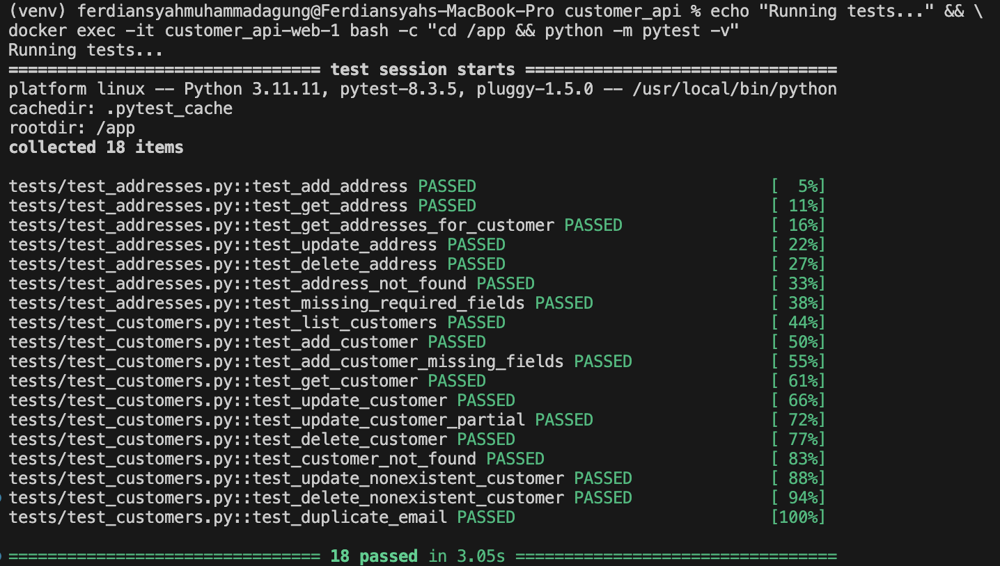
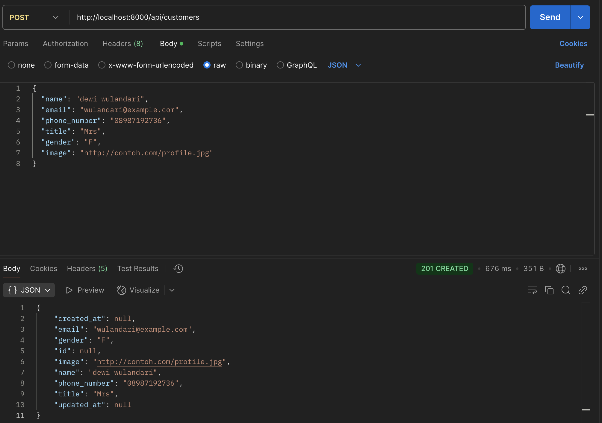
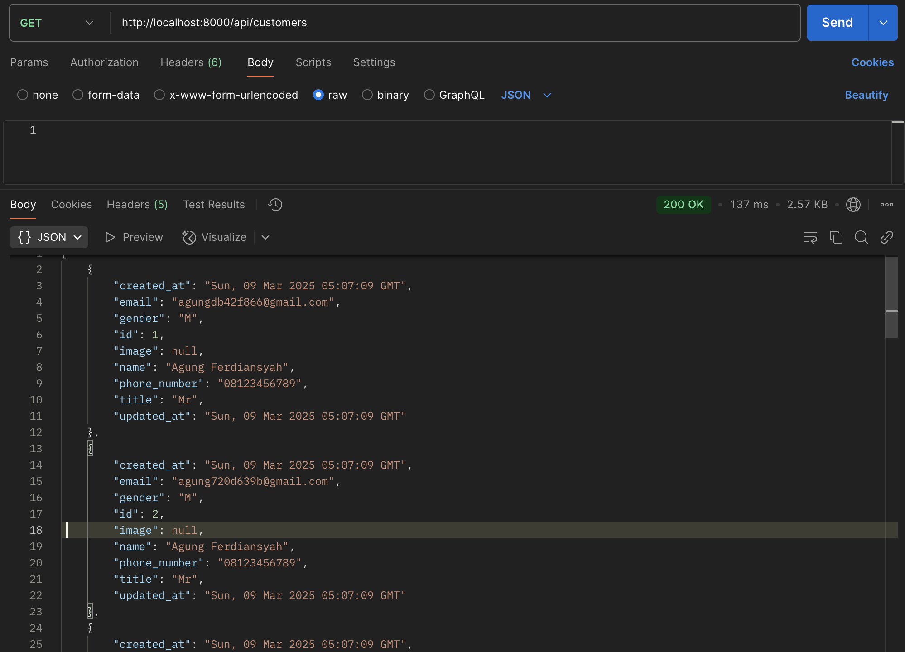
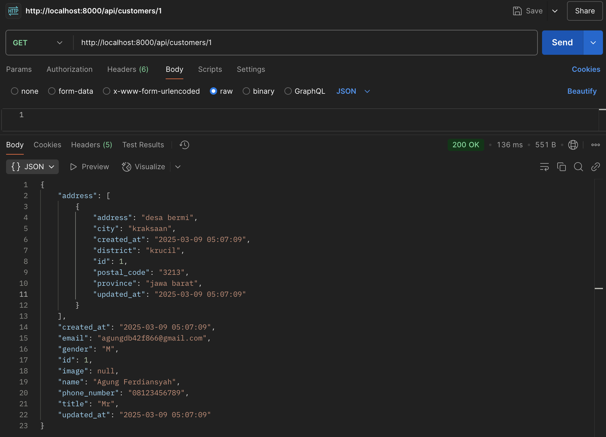
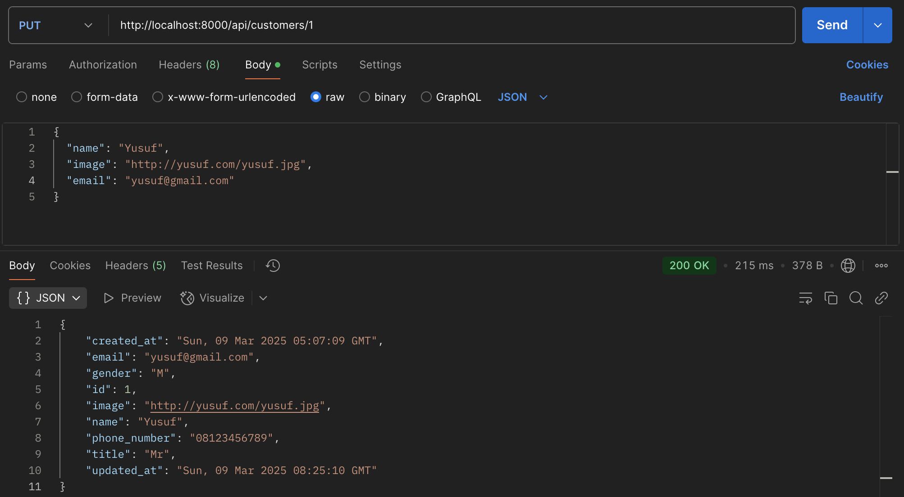
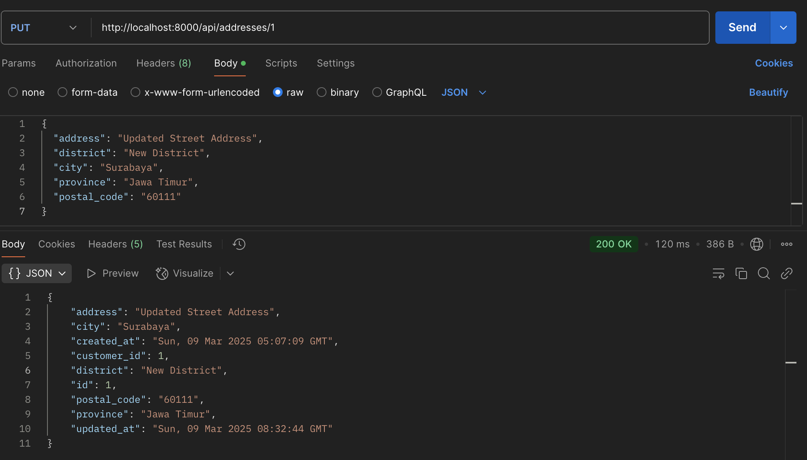
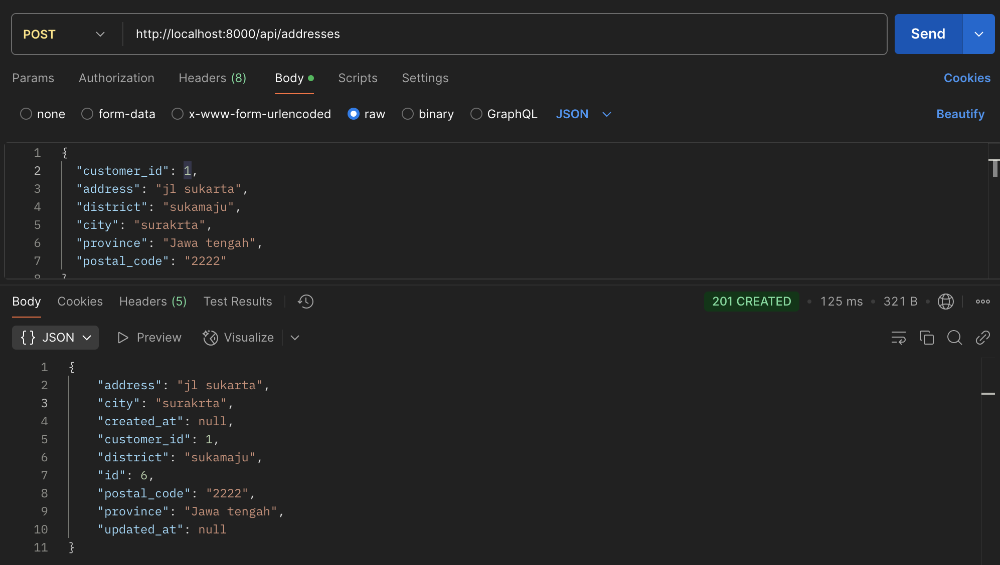
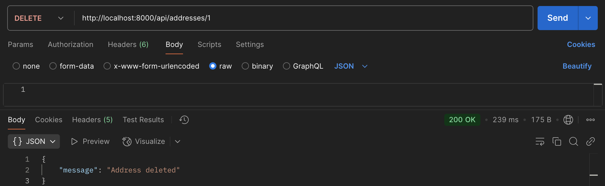
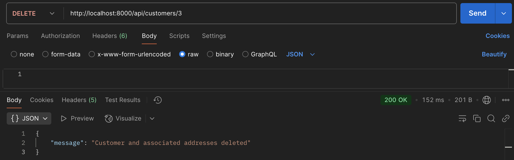

# Customer API - RESTful Backend Service

A comprehensive RESTful API service for customer and address management, featuring full CRUD operations, data validation, and extensive test coverage.

## Features

- **Customer Management**: Create, read, update, and delete customer records
- **Address Management**: Associate multiple addresses with each customer
- **Image Support**: Upload and retrieve customer profile images
- **Data Validation**: Prevent duplicate emails and enforce required fields
- **RESTful Design**: Following REST principles with appropriate HTTP verbs and status codes
- **Comprehensive Test Suite**: Automated tests for all API endpoints

## Tech Stack

- **Python 3.11**: Core programming language
- **Flask**: Lightweight web framework for API development
- **MySQL 8**: Relational database for data storage
- **Docker**: Containerization for consistent development and deployment
- **Docker Compose**: Multi-container Docker applications
- **Pytest**: Testing framework for automated tests
- **Git**: Version control system

## Setup and Installation

### Prerequisites

- Docker and Docker Compose
- Git

### Setup Instructions

1. Clone the repository:
   ```bash
   git clone https://github.com/agungferdi/Customers-API-Technical-Test-.git
   cd Customers-API-Technical-Test-
   ```

2. Start the Docker containers and run tests (all in one command):
   ```bash
   docker-compose up -d && \
   echo "Waiting for database to initialize..." && \
   echo "Copying files to container..." && \
   docker cp routes/customer_routes.py customer_api-web-1:/app/routes/ && \
   docker cp routes/address_routes.py customer_api-web-1:/app/routes/ && \
   docker cp tests/test_customers.py customer_api-web-1:/app/tests/ && \
   docker cp tests/test_addresses.py customer_api-web-1:/app/tests/ 2>/dev/null || echo "No test_addresses.py found" && \
   echo "Running tests..." && \
   docker exec -it customer_api-web-1 bash -c "cd /app && python -m pytest -v"
   ```
   It Should be like this:
   
## Project Structure

```
customer_api/
├── app.py                  # Main application entry point
├── docker-compose.yml      # Docker Compose configuration
├── Dockerfile              # Docker build instructions
├── models/                 # Data models
│   ├── customer.py
│   └── address.py
├── routes/                 # API route handlers
│   ├── customer_routes.py
│   └── address_routes.py
├── tests/                  # Testing
│   ├── test_customers.py
│   └── test_addresses.py
├── utils/                  # Utility functions
│   └── database.py
└── migrations/             # Database schema migrations
    └── init_db.sql
```

## API Endpoints

### Customer Endpoints

| Method | Endpoint | Description |
|--------|----------|-------------|
| GET | `/api/customers` | List all customers |
| POST | `/api/customers` | Create a new customer |
| GET | `/api/customers/{id}` | Get customer details by ID and its adrress |
| PUT | `/api/customers/{id}` | Update customer details |
| DELETE | `/api/customers/{id}` | Delete a customer |

### Address Endpoints

| Method | Endpoint | Description |
|--------|----------|-------------|
| GET | `/api/customers/{customer_id}/addresses` | List customer's addresses |
| POST | `/api/addresses` | Add a new address |
| GET | `/api/addresses/{id}` | Get address details by ID |
| PUT | `/api/addresses/{id}` | Update address details |
| DELETE | `/api/addresses/{id}` | Delete an address |

## Working with Test Data

After running the test suite, several customer and address records will be created in the database. You can interact with this data via the API endpoints listed above.

## API Usage Examples with Postman

### 1. Create a New Customer


### 2. List All Customers


### 3. Detail of customers (with associated address)


### 4. Update a Customer

### 5. Update address

### 6. Add an Address to a Customer

### 7. Delete an Address

### 8. Delete a Customerf


 

created by Agung For Technical Test - Backend Engineer

