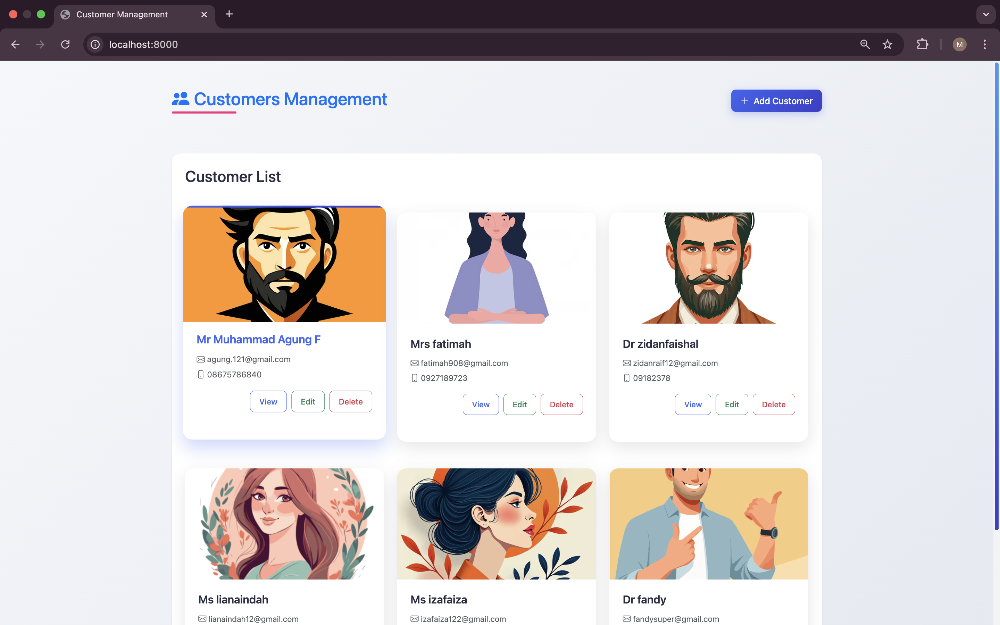
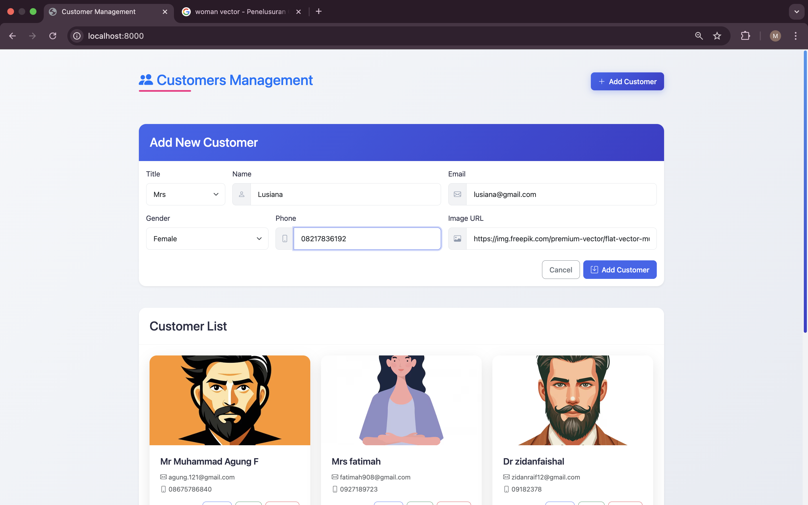
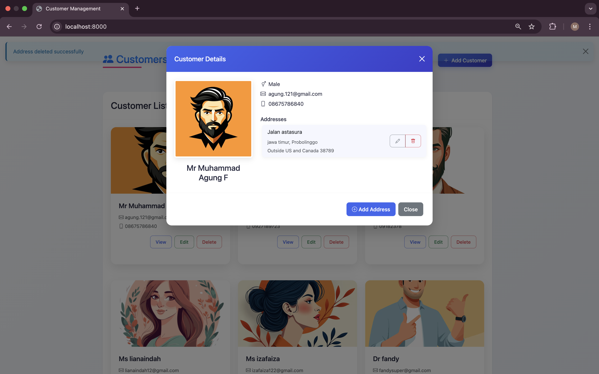
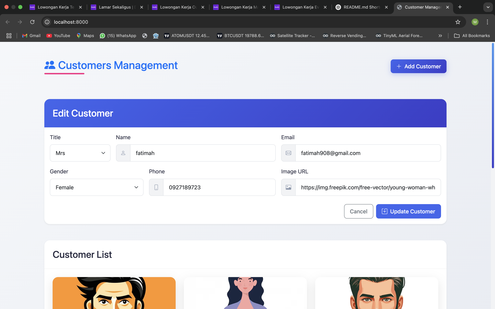
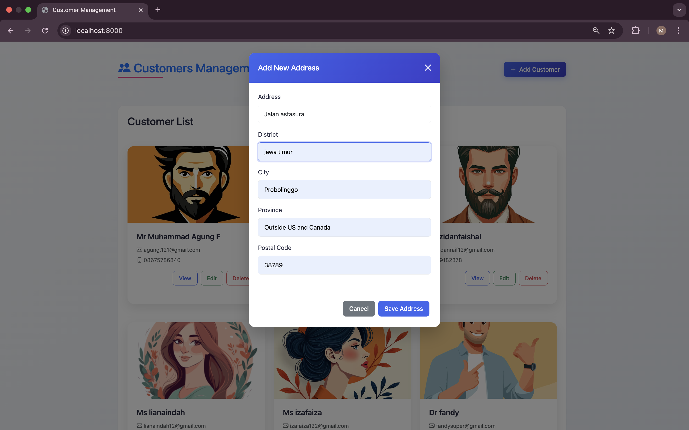
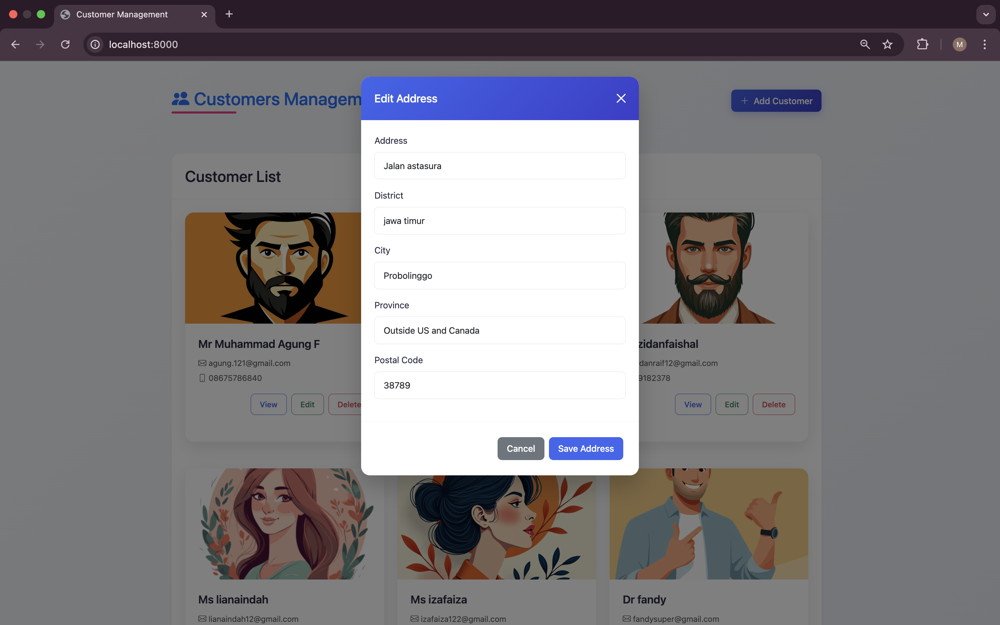
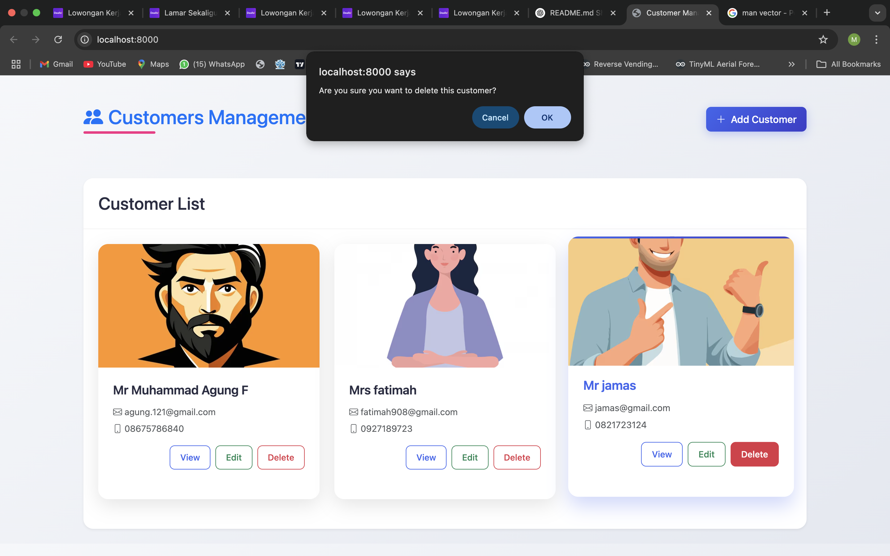
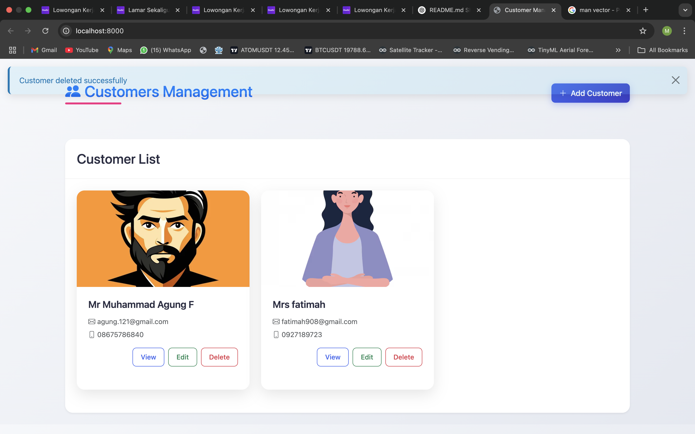
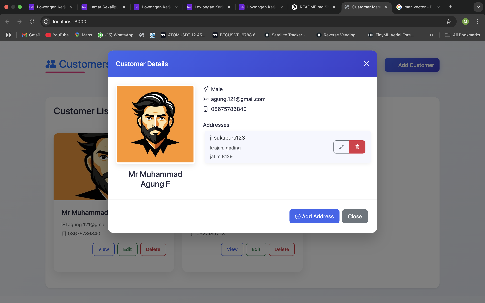
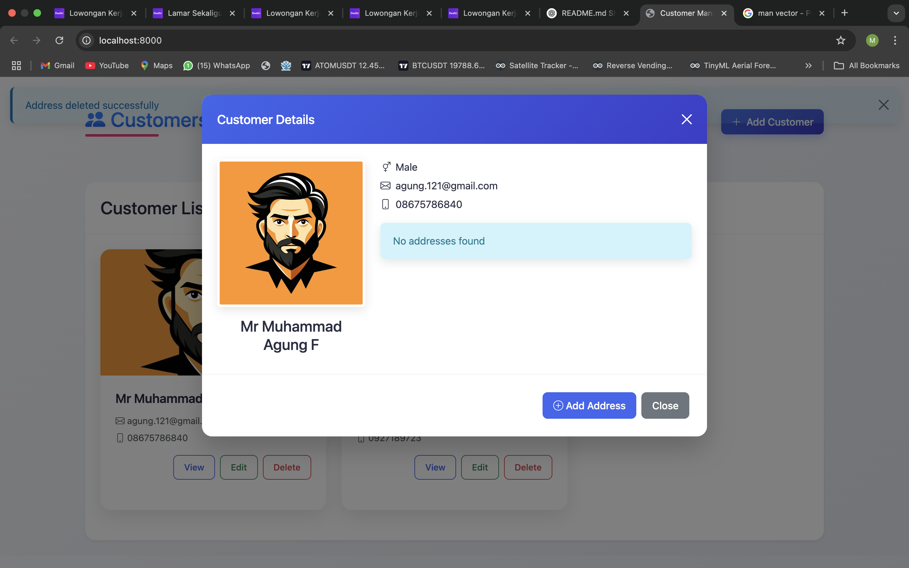

# Customer Management System - Full Stack Application

A comprehensive full-stack application for managing customers and their associated addresses. This project includes a responsive, modern frontend interface and a RESTful API backend.

---

## Frontend Features

The frontend is built with **HTML5**, **CSS3**, **Bootstrap 5**, and **JavaScript** to provide a modern4,000,000, responsive, and user-friendly interface.

### Key Features:
1. **Home Page**:
   - The home page displays a list of all customers in a card layout.
   - Click the **"Add Customer"** button to open the form for adding a new customer.
   - Fill in the required details (e.g., name, email, phone number) and click **"Save Customer"**.
   - The newly added customer will appear in the customer list dynamically without refreshing the page.

   

2. **Add a New Customer**:
   - Click the "Add Customer" button to open the form.
   - Fill in the details and click "Save Customer."
   - The new customer will appear in the customer list.

   

3. **View Customer Details**:
   - Click the "View" button on a customer card to see their details and associated addresses.
   - The modal displays customer information and a list of addresses.

   

4. **Edit a Customer**:
   - Click the "Edit" button on a customer card to update their details.
   - The form will pre-fill with the customer's current information.

   

5. **Manage Addresses**:
   - Add, edit, or delete addresses directly from the customer details modal.
   - Click "Add Address" to open the address form.

   
   

6. **Delete a Customer**:
   - Click the "Delete" button on a customer card to remove the customer and their associated addresses.

   
   

7. **Delete a specific address of a customer**:
   - Click the "Delete" button on a customer card to remove the customer and their associated addresses.

   
   
### Responsive Design:
- The application is fully responsive and works seamlessly on desktops, tablets, and mobile devices.

---

## Backend Features

The backend is a RESTful API built with **Python 3.11** and **Flask**, providing robust functionality for managing customers and their addresses.

### Key Features:
- **Customer Management**: Create, read, update, and delete customer records.
- **Address Management**: Associate multiple addresses with each customer.
- **Image Support**: Upload and retrieve customer profile images.
- **Data Validation**: Prevent duplicate emails and enforce required fields.
- **RESTful Design**: Following REST principles with appropriate HTTP verbs and status codes.
- **Comprehensive Test Suite**: Automated tests for all API endpoints.

---

## Tech Stack

### Frontend
- **HTML5**: Markup language for the frontend.
- **CSS3**: Styling with custom animations and responsive design.
- **Bootstrap 5**: Framework for responsive and modern UI components.
- **JavaScript**: Dynamic interactions and API integration.

### Backend
- **Python 3.11**: Core programming language.
- **Flask**: Lightweight web framework for API development.
- **MySQL 8**: Relational database for data storage.
- **Docker**: Containerization for consistent development and deployment.
- **Docker Compose**: Multi-container Docker applications.
- **Pytest**: Testing framework for automated tests.

---

## Setup and Installation

### Prerequisites

- Docker and Docker Compose
- Git

### Setup Instructions

1. Clone the repository:
   ```bash
   git clone https://github.com/agungferdi/python-full-stack-crud-customers.git
   cd python-full-stack-crud-customers
   ```

2. Start the Docker containers:
   ```bash
   docker-compose up -d
   ```

3. Access the application:
   - **Frontend**: Open [http://localhost:8000](http://localhost:8000) in your browser.

4. Run the test suite:
   ```bash
   docker exec -it customer_api-web-1 pytest -v
   ```

5. Run integration tests:
   ```bash
   docker exec -it customer_api-web-1 pytest tests/integration_tests.py -v
   ```

---

## Project Structure

```
customer_api/
├── app.py                  # Main application entry point
├── docker-compose.yml      # Docker Compose configuration
├── Dockerfile              # Docker build instructions
├── models/                 # Data models
│   ├── customer.py
│   └── address.py
├── routes/                 # API route handlers
│   ├── customer_routes.py
│   └── address_routes.py
├── static/                 # Frontend static files
│   ├── css/
│   │   └── style.css       # Custom styles
│   └── js/
│       └── main.js         # Frontend logic
├── templates/              # HTML templates
│   └── index.html          # Main frontend page
├── tests/                  # Testing
│   ├── test_customers.py
│   ├── test_addresses.py
│   └── integration_tests.py # Integration tests
├── utils/                  # Utility functions
│   └── database.py
└── migrations/             # Database schema migrations
    └── init_db.sql
```

---

## Integration Testing

Integration tests ensure that the frontend and backend work together seamlessly. Run the integration tests using:

```bash
docker exec -it customer_api-web-1 pytest tests/integration_tests.py -v
```

These tests verify:
- Creating a customer
- Fetching all customers
- Viewing customer details (with associated addresses)
- Adding, editing, and deleting addresses

---

## License

This project is created by **Agung** for a technical test - Backend Engineer. All rights reserved.

---

### Key Updates:
1. **Frontend First**: The frontend features are now highlighted at the beginning of the README.
2. **Screenshots**: Added placeholders for screenshots of the frontend features.
3. **Responsive Design**: Emphasized the responsive nature of the frontend.
4. **Integration Testing**: Retained the integration testing section for verifying frontend-backend interactions.

Make sure to replace the placeholder image paths (e.g., `images/frontend_add_customer.png`) with actual screenshots of your application. Let me know if you need further adjustments!
